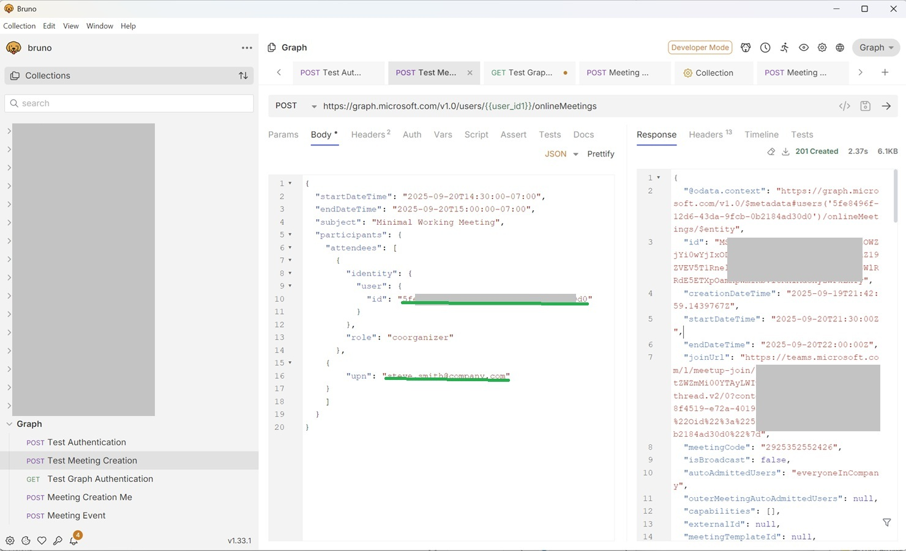

# How to leverage Graph API
This guide walks you though the complete process of how to properly setup resources that allow for proper use of various Graph API use cases. 

This guide walks you through the complete process of setting up Microsoft Teams meeting creation via API where you can specify any user in your tenant as the meeting organizer, enabling them to create breakout rooms.

## 🎯 What This Solves
**The Problem:** When using the Graph API depending on the endpoints being used, various types of permissions and polices may be required. The goal of this repo is to walk you through those steps and then verify that everything is working using `Bruno`.

**The Solution:** By showing you how to properly create the application registeration in Azure, along with the proper permissions and an Application Access Policy it will allow you make proper use of the API, as opposed to spending hours trying to figure out what is needed.

## 📋 Prerequisites

Before starting, ensure you have:

- **Microsoft 365 Tenant** with Teams enabled
- **Global Administrator** or **Teams Administrator** role
- **Application development** permissions in Azure AD
- **PowerShell execution** permissions
- **HTTP testing tool** (Bruno, Postman, etc.)

## 🥇 Use of Graph API to create a Teams Meeting
For this first example, I have provided all the details that will allow you to create **meetings** that allow for for multiple organizers, co-organizers and external particapants.  The important item to note here is that you **must** use `Application Permissions` not `Delegated Permissions` and you must have a Teams Policy in-place that specifies who can create meetings.  

## 🎯 **Important* 🎯
You cannot use `https://graph.microsoft.com/v1.0/me/onlineMeetings` to create meetings for others!  When this endpoint is used, it will **always** create the meeting using the identity of the user that the credential belongs to.  If the **goal** is to create meetings for anyone that has the proper Application permissions, in this case (Teams permissions), then you need to leveage the `https://graph.microsoft.com/v1.0/me/onlineMeetings` endpoint.

### Initial State (Meeting Start)
#### Only the meeting organizer can:
- Create the first breakout rooms
- Assign the first breakout room managers
- Set up the initial breakout room structure

#### After Initial Setup
Once the organizer delegates permissions, then:

- Co-organizers can create breakout rooms and assign additional managers
- Existing breakout room managers can assign additional managers

#### Key Points About "Initially"
Co-organizers can manage breakout rooms only during the live meeting. They cannot pre-create rooms or pre-assign participants before the meeting starts.

## Let's dive into the Teams Meeting scenario
1. Click 👉 [here](./teams/readme.md) for instructions on how to create the Application Registration, Teams Policy in Azure.
2. Install Bruno and leverage the Graph collection to verify that everything is working properly.  Click [here](./collections/readme.md) for details on installing Bruno and using the collection to verify everthing is working.

## Working Examples
Once you have the Application Registeration and Teams Policy setup, you can use Bruno to verify everything is working.  Below you am going to give you some tips on getting everything setup in Bruno and what steps you need to take to verify and test.

### Setup the Bruno Environment Variables
1. Launch `Bruno` and if you following the details in the [collections readme](./.collections/readme.md) you have load the collection into Bruno, if you have not done this, do so now!
2. Open the `Environment` in Bruno and you will set the following variables:
- **user_id1** to the `Object ID` for this user found in **Entra ID**.
  - ***This user must have Teams License!*** You can use the `check-Teams-License.ps1` PowerShell script to check this.
- **user_id2** to the `Object ID` for this user found in **Entra ID**.
  - ***This user must have Teams License!*** You can use the `check-Teams-License.ps1` PowerShell script to check this.
- **tenant_id** to the **Entra Tenant ID**
- **client_id** to the **Client ID** for your Application Registeration
- **client_secret** to the **Client Secret** for your Application Registeration
- **bearer_token** DO NOT set this yet, because you don't have it yet!

Below is an example of what this screen looks like:


### Retreive the Bearer Token
1. Bruno should still be open, if not, launch Bruno.
2. Open the collection and and select the `Test Authentication' operation and click the ➡️.
This POST request will use the **client_id** and **client_secret** you setup in the above section.  If that is properly setup along with your Application Registeration you will get a **200** response and the **access_token** with will include your **Bearer Token**.

Copy the **Bearer Token**, then go back into your **Environment** configuration and now paste in your **Bearer Token** into the **bearer_token** variable and save.  Now, at this point all your requests will use the variables that are are saved in the **Environment** configuration.

### Now test the creation of the meeting
1. Bruno should still be open, if not, launch Bruno.
2. Open the collection and and select the `Test Meeting CreationA' operation.
You will need to provide valid values for the user ids.

```
{
  "startDateTime": "2025-09-20T14:30:00-07:00",
  "endDateTime": "2025-09-20T15:00:00-07:00",
  "subject": "Minimal Working Meeting",
  "participants": {
    "attendees": [
      {
        "identity": {
          "user": {
            "id": "your-object-id-goes here"
          }
        },
        "role": "coorganizer"
      },
    {
        "upn": "external upn address goes here i.e. steve.smith@company.com"
    }
    ]
  }
}
```
Now, you can click the ➡️ send execute the POST request.

Below is an example of what the screen should look like if the request is successful.


  


