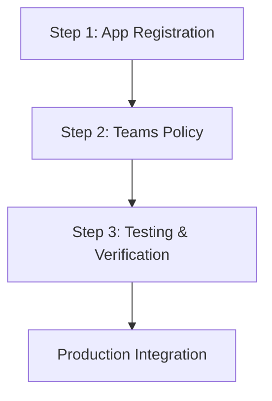

# Microsoft Teams Meeting API Setup Guide

This guide walks you through the complete process of setting up Microsoft Teams meeting creation via API where you can specify any user in your tenant as the meeting organizer, enabling them to create breakout rooms.

## 🎯 What This Solves

**The Problem:** When creating Teams meetings via Microsoft Graph API using delegated permissions, the authenticated user always becomes the meeting organizer. This prevents others from creating breakout rooms since only the organizer can do so.

**The Solution:** By using application permissions with an Application Access Policy, your application can create meetings where any specified user becomes the organizer and can create breakout rooms manually through the Teams UI.

## 📋 Prerequisites

Before starting, ensure you have:

- **Microsoft 365 Tenant** with Teams enabled
- **Global Administrator** or **Teams Administrator** role
- **Application development** permissions in Azure AD
- **PowerShell execution** permissions
- **HTTP testing tool** (Bruno, Postman, etc.)

## 🚀 Setup Overview

This setup involves **3 critical steps** that must be completed in order:



### ⚠️ Important Notes

- **All steps are mandatory** - skipping any step will result in API failures
- **Order matters** - complete steps sequentially 
- **Wait times required** - policy propagation takes 30-60 minutes
- **Admin permissions needed** - some steps require administrative access

---

## 👥 Multiple Breakout Room Managers

### The Challenge
By default, only the meeting organizer can create breakout rooms. However, in many business scenarios (incident response, training sessions, large meetings), you may need **multiple people** to be able to create and manage breakout rooms.

### Available Solutions
Microsoft Teams provides several mechanisms to delegate breakout room management to others:

#### ✅ **Co-Organizers (Recommended)**
- Add up to 10 co-organizers who can manage breakout rooms during live meetings
- Must be from the same organization/tenant
- Can be assigned via API at meeting creation
- Have near-organizer permissions

#### ✅ **Breakout Room Managers**  
- Appoint presenters as dedicated breakout room managers
- Must be configured during the meeting or in meeting options
- Only one manager can control rooms at a time

#### ✅ **Multiple Primary Organizers**
- Create different meetings with different organizers via API
- Each organizer has full breakout room control
- Requires Application Access Policy for each potential organizer

### API Implementation Example
```json
{
  "subject": "Meeting with Multiple Breakout Room Managers",
  "participants": {
    "organizer": {
      "upn": "primary.organizer@contoso.com"
    },
    "attendees": [
      {
        "upn": "co.organizer1@contoso.com",
        "role": "coOrganizer"  // ← Can create breakout rooms
      },
      {
        "upn": "co.organizer2@contoso.com", 
        "role": "coOrganizer"  // ← Can create breakout rooms
      },
      {
        "upn": "presenter@contoso.com",
        "role": "presenter"    // ← Can be breakout room manager
      }
    ]
  }
}
```

### Key Benefits
- **Redundancy**: Multiple people can manage breakout rooms if primary organizer is unavailable
- **Scalability**: Distribute breakout room management across team members
- **Flexibility**: Choose different organizers based on incident type, expertise, or availability
- **Coverage**: 24/7 incident response with different shift managers as organizers

**📖 For complete details, implementation examples, and API calls, see: [Additional-Considerations.md](./Additional-Considerations.md)**

---

## 🔧 Step 1: Create Azure App Registration

**What:** Set up an Azure AD application registration with the correct permissions and authentication credentials.

**Why:** This provides your application with the identity and permissions needed to call Microsoft Graph API on behalf of users.

### Key Components Created:
- ✅ Azure AD App Registration
- ✅ Application Permissions (`OnlineMeetings.ReadWrite.All`)  
- ✅ Client Secret for authentication
- ✅ Admin consent granted

### Time Required: 15 minutes

**📖 For detailed step-by-step instructions, see: [Portal-Instructions.md](./Portal-Instructions.md)**

**Output:** You'll have a Client ID, Client Secret, and Tenant ID needed for the next steps.

---

## 🛡️ Step 2: Create Teams Application Access Policy

**What:** Configure a PowerShell-based policy that authorizes your application to create meetings on behalf of specific users.

**Why:** Even with correct app permissions, Microsoft requires an additional layer of security through Application Access Policies. Without this policy, you'll get "Access Denied" errors when trying to create meetings.

### Key Components Created:
- ✅ Application Access Policy in Teams
- ✅ Policy assignment to specific users or globally
- ✅ Verification of policy propagation

### Critical Requirements:
- **Teams Administrator** or **Global Administrator** role required
- **PowerShell module** installation and configuration  
- **30-60 minute wait time** for policy propagation

### Time Required: 20 minutes + 30-60 minute wait time

**📖 For detailed step-by-step instructions, see: [Teams-Policy.md](./Teams-Policy.md)**

**Output:** Users specified in the policy can have meetings created on their behalf via API.

---

## 🧪 Step 3: Test with Bruno (or HTTP Client)

**What:** Verify your setup works by testing the authentication and meeting creation endpoints using an HTTP client.

**Why:** Before integrating into your production application, you need to confirm that both authentication and meeting creation work correctly with the specified organizers.

### Testing Components:
- ✅ Client Credentials authentication flow
- ✅ Access token generation and management
- ✅ Meeting creation with specific organizers
- ✅ Verification that correct user becomes organizer
- ✅ Confirmation that organizer can create breakout rooms

### Recommended Tool: Bruno
We recommend **Bruno** as it's free, modern, and handles environment variables well. However, you can use any HTTP client (Postman, Insomnia, cURL, etc.).

### Time Required: 30 minutes

**📖 For detailed Bruno setup and testing instructions, see: [Test.Bruno.md](./Test.Bruno.md)**

**Output:** Confirmed working API calls that can be integrated into your application.

---

## 🔄 Complete Workflow Summary

### Phase 1: Azure Setup (Step 1)
1. Create App Registration in Azure Portal
2. Configure application permissions  
3. Generate client secret
4. Grant admin consent

### Phase 2: Policy Setup (Step 2)  
1. Install Teams PowerShell module
2. Create Application Access Policy
3. Assign policy to users
4. **Wait 30-60 minutes** for propagation

### Phase 3: Testing (Step 3)
1. Test authentication (get access token)
2. Test meeting creation with specific organizers
3. Verify organizer can create breakout rooms in Teams
4. Document working API calls

### Phase 4: Production Integration
1. Implement API calls in your application (xMatters, etc.)
2. Add proper error handling and token refresh
3. Monitor and maintain the integration

## ⏱️ Timeline Expectations

| Step | Duration | Wait Time | Total |
|------|----------|-----------|-------|
| **Step 1: App Registration** | 15 minutes | None | 15 minutes |
| **Step 2: Teams Policy** | 20 minutes | 30-60 minutes | 50-80 minutes |  
| **Step 3: Testing** | 30 minutes | None | 30 minutes |
| **Total Setup Time** | 65 minutes | 30-60 minutes | **95-125 minutes** |

## 🚨 Common Pitfalls to Avoid

### ❌ Skipping Admin Consent
**Problem:** App permissions granted but admin consent not provided  
**Result:** Authentication fails with "consent required" errors  
**Solution:** Follow Step 1 completely, including admin consent

### ❌ Using Delegated Instead of Application Permissions  
**Problem:** Using `OnlineMeetings.ReadWrite` (delegated) instead of `OnlineMeetings.ReadWrite.All` (application)  
**Result:** Cannot specify different organizers, token owner becomes organizer  
**Solution:** Use application permissions as detailed in Portal-Instructions.md

### ❌ Testing Before Policy Propagation
**Problem:** Testing API calls immediately after creating policy  
**Result:** "Access Denied" or "Forbidden" errors  
**Solution:** Wait the full 30-60 minutes as specified in Teams-Policy.md

### ❌ Incorrect PowerShell Execution
**Problem:** Running policy commands without proper admin rights or module installation  
**Result:** Policy creation fails or assignments don't work  
**Solution:** Follow Teams-Policy.md exactly, ensure proper admin role

### ❌ Wrong Authentication Flow
**Problem:** Using user authentication instead of client credentials flow  
**Result:** Cannot create meetings for other users  
**Solution:** Use client credentials as shown in Test.Bruno.md

---

## 🔒 Security Considerations

### Principle of Least Privilege
- **Recommended:** Assign policy to specific users only
- **Avoid:** Global policy assignments unless absolutely necessary
- **Monitor:** Regular audits of who has meeting creation privileges

### Credential Security
- **Client Secret:** Store securely, rotate periodically
- **Access Tokens:** Implement proper refresh mechanisms
- **Logging:** Monitor API usage and unauthorized access attempts

### Policy Scope
```powershell
# Preferred: Specific users
Grant-CsApplicationAccessPolicy -PolicyName "YourPolicy" -Identity "user@company.com"

# Use with caution: Global assignment  
Grant-CsApplicationAccessPolicy -PolicyName "YourPolicy" -Global
```

---

## 📚 Documentation Structure

This guide references several detailed documentation files:

```
├── README.md (this file) - Overview and navigation
├── Portal-Instructions.md - Azure App Registration setup
├── Teams-Policy.md - PowerShell policy creation
├── Test.Bruno.md - API testing with Bruno
└── Additional-Considerations.md - Multiple breakout room managers
```

Each document is self-contained with complete instructions for its respective phase.

---

## ✅ Success Criteria

You'll know the setup is complete and working when:

1. ✅ **Azure App Registration** created with application permissions and admin consent
2. ✅ **Teams Policy** created and assigned to target users  
3. ✅ **30+ minutes waited** for policy propagation
4. ✅ **Authentication working** - can get access tokens via client credentials
5. ✅ **Meeting creation working** - can create meetings with specified organizers
6. ✅ **Organizer verification** - specified user becomes meeting organizer in response
7. ✅ **Breakout room capability** - meeting organizer can create breakout rooms in Teams UI

---

## 🚫 Current Limitations

Even after successful setup, be aware of these Microsoft limitations:

### ❌ No Breakout Room API
- **Reality:** Breakout rooms must be created manually through Teams UI
- **Impact:** Organizers need to create breakout rooms after joining the meeting
- **Workaround:** None - this is a Microsoft Graph API limitation

### ❌ Policy Propagation Delays
- **Reality:** Policies can take up to 60 minutes to propagate
- **Impact:** Cannot test immediately after policy creation
- **Workaround:** Plan for wait times in your implementation timeline

### ❌ PowerShell Requirement
- **Reality:** Application Access Policies can only be created via PowerShell
- **Impact:** No Azure Portal UI alternative available
- **Workaround:** None - PowerShell is the only option

---

## 🆘 Getting Help

### Step-Specific Issues
- **App Registration problems:** See troubleshooting in Portal-Instructions.md
- **Policy creation issues:** See troubleshooting in Teams-Policy.md  
- **API testing problems:** See troubleshooting in Test.Bruno.md

### General Microsoft Resources
- [Microsoft Graph Documentation](https://docs.microsoft.com/en-us/graph/)
- [Teams PowerShell Reference](https://docs.microsoft.com/en-us/powershell/teams/)
- [Azure App Registration Guide](https://docs.microsoft.com/en-us/azure/active-directory/develop/)

### Common Commands for Verification
```powershell
# Check if policy exists
Get-CsApplicationAccessPolicy -Identity "YourPolicyName"

# Check user policy assignment
Get-CsUserPolicyAssignment -Identity "user@domain.com" -PolicyType ApplicationAccessPolicy

# Test API authentication  
curl -X POST "https://login.microsoftonline.com/{tenant}/oauth2/v2.0/token" -d "grant_type=client_credentials&client_id={id}&client_secret={secret}&scope=https://graph.microsoft.com/.default"
```

---

## 🎯 Next Steps

After completing this setup:

1. **Integrate into your application** (xMatters, custom app, etc.)
2. **Implement error handling** for token refresh and API failures  
3. **Set up monitoring** for API usage and performance
4. **Train users** on creating breakout rooms in Teams UI
5. **Document your integration** for future maintenance

---

**🚀 Ready to get started? Begin with [Portal-Instructions.md](./Portal-Instructions.md) for the Azure App Registration setup!**